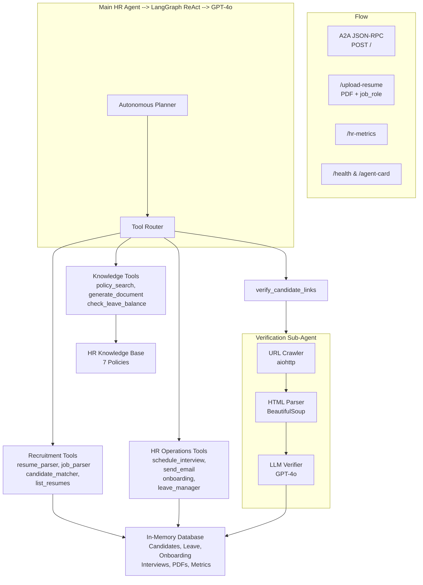
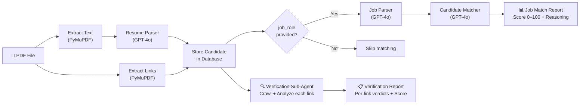

# 🤖 Universal HR Autonomous Agent

An industry-agnostic, production-ready AI HR operations agent built on **FastAPI** with **LangChain** tool-calling, serving the **A2A JSON-RPC** protocol for the Nasiko AI platform.

---

## 📋 Overview

The Universal HR Agent automates HR workflows across any domain — technology, finance, healthcare, marketing, manufacturing, and more:

| Capability | Description |
|---|---|
| **Resume Parsing** | Extract structured candidate data from text or uploaded PDF resumes |
| **PDF Resume Upload** | Upload resume PDFs — automatically extracts text, links, and triggers verification |
| **Link Verification** | Autonomous sub-agent crawls resume URLs to verify project & certification claims |
| **Job Matching** | Score candidates against job requirements (0–100) with explainable reasoning |
| **Interview Scheduling** | Generate interview slots and confirm with both parties |
| **Email Communication** | Send professional HR emails (invitations, notifications, onboarding) |
| **Onboarding Management** | Track and update employee onboarding checklists |
| **Leave Management** | Process leave requests, check balances, approve/reject |
| **HR Policy Helpdesk** | Answer employee questions from the HR knowledge base |
| **Document Generation** | Generate offer letters, confirmations, experience letters |

---

## � What Can This Agent Do?

Below is the full list of tasks you can ask the agent to perform, grouped by category.

### 📄 Resume & Candidate Management
- Parse a resume from raw text and extract structured data (name, email, skills, education, experience, links)
- Upload a PDF resume for automatic parsing, link extraction, and verification
- Upload a PDF resume **with a job role** to get an instant fit score (0–100) with reasoning
- List all available candidate resumes in the database
- Verify links found in a candidate's resume (GitHub, LinkedIn, portfolios, certifications)

### 💼 Job Matching & Recruitment
- Parse a job description to extract required skills, responsibilities, experience level, and domain
- Match a specific candidate against a job description and get a compatibility score with reasoning
- Run a **full recruitment pipeline**: list candidates → match against a job → rank by score → schedule interviews → send invitations
- Find the best candidate for a specific role from the database

### 📅 Interview Scheduling
- Schedule an interview between a candidate and an interviewer
- Send interview invitation emails to shortlisted candidates

### 📧 Email Communication
- Send professional HR emails (interview invitations, offer notifications, onboarding instructions)
- Send custom emails with any subject and body to any recipient

### 🚀 Employee Onboarding
- Set up a full onboarding checklist for a new employee (7 tasks: Identity Verification, Payroll & Tax Setup, System Access, Company Policy, Team Introduction, IT Equipment, Benefits Enrollment)
- Mark individual onboarding tasks as completed
- View the current onboarding status for any employee

### 🏖️ Leave Management
- Check leave balance for an employee
- Process a leave request (auto-approves or rejects based on available balance)
- View leave details (total, used, remaining days)

### 📖 HR Policy Helpdesk
- Answer questions about **leave policy** (24 days/year, accrual, carry-forward rules)
- Answer questions about **maternity & paternity leave** (26 weeks maternity, 4 weeks paternity)
- Answer questions about **reimbursement policy** (categories, limits, documentation)
- Answer questions about **remote work policy** (3 days/week, core hours, equipment)
- Answer questions about **code of conduct** (ethics, harassment, confidentiality)
- Answer questions about **performance review policy** (semi-annual, ratings, PIP)
- Answer questions about **benefits policy** (health insurance, 401k, wellness stipend)

### 📝 Document Generation
- Generate an **offer letter** for a candidate
- Generate **onboarding instructions** for a new hire
- Generate an **employment confirmation** letter
- Generate a **promotion letter**
- Generate an **experience letter** for a departing employee

### 📊 Monitoring & Metrics
- View HR metrics dashboard (resumes screened, candidates matched, interviews scheduled, etc.)
- Health check the running agent
- View the agent card (capabilities, skills, protocol version)

---

## 🏗️ Architecture

### System Overview



### Agent Details

| Agent | Model | Role | Invoked By |
|---|---|---|---|
| **Main HR Agent** | GPT-4o via LangGraph `create_react_agent` | Autonomous planning & execution of all HR workflows via 13 tools | A2A JSON-RPC at `POST /` |
| **Verification Sub-Agent** | GPT-4o (direct calls) | Crawls resume URLs, extracts page content, evaluates per-link authenticity | `verify_candidate_links` tool or `/upload-resume` |
| **Resume Parser** | GPT-4o (direct calls) | Extracts structured candidate data from raw resume text | `resume_parser` tool or `/upload-resume` |
| **Job Description Parser** | GPT-4o (direct calls) | Extracts structured job requirements from description text | `job_description_parser` tool or `/upload-resume` (with `job_role`) |
| **Candidate Matcher** | GPT-4o (direct calls) | Scores candidate-job fit (0–100) with detailed reasoning | `candidate_matcher` tool or `/upload-resume` (with `job_role`) |

### Resume Upload Pipeline



---

## 🛠️ Tools Reference

| Tool | Input | Output |
|---|---|---|
| `resume_parser` | Resume text | JSON with name, email, skills, education, experience, links |
| `job_description_parser` | Job description text | JSON with title, skills, responsibilities, domain |
| `candidate_matcher` | Candidate JSON + Job JSON | Score (0–100) + reasoning |
| `schedule_interview` | Candidate email, Interviewer email | Confirmed time slot |
| `send_email` | Recipient, Subject, Body | Delivery confirmation |
| `update_onboarding` | Employee name, Task name | Completion confirmation |
| `get_onboarding_status` | Employee name | Full checklist with status |
| `leave_manager` | Employee name, Days requested | Approval/rejection result |
| `check_leave_balance` | Employee name | Balance details |
| `policy_search` | Natural language query | Matching policy text |
| `generate_document` | Employee name, Document type | Generated document |
| `verify_candidate_links` | Candidate name | Per-link verdicts + overall score |
| `list_sample_resumes` | — | All available candidate summaries |

---

## 🔄 Example Workflows

### Recruitment Pipeline
```
User:  "We need to hire a marketing manager with SEO experience."

Agent PLAN:
  1. Parse job description
  2. List available candidates
  3. Match each candidate to the job
  4. Rank by score
  5. Schedule interviews for top candidates
  6. Send interview invitations

Agent then executes each step using the appropriate tools.
```

### Resume Upload + Verification + Job Matching
```
POST /upload-resume  (with PDF file + optional job_role)

→ Extracts text via PyMuPDF
→ Extracts all hyperlinks (GitHub, LinkedIn, portfolios, certs)
→ Parses candidate data via LLM
→ Verification sub-agent crawls each link
→ If job_role provided: matches candidate against job → score (0-100) + reasoning
→ Returns parsed data + verification report + job match (when applicable)
```

### HR Policy Query
```
User: "What is the maternity leave policy?"
Agent: Uses policy_search tool → Returns the full maternity leave policy
```

---

## 🚀 Local Setup

### Prerequisites
- Python 3.12+
- OpenAI API key

### Installation

```bash
# Clone the repository
git clone <repo-url>
cd universal_hr_agent

# Create virtual environment
python -m venv venv
source venv/bin/activate  # Linux/Mac
# venv\Scripts\activate   # Windows

# Install dependencies
pip install -r requirements.txt

# Configure environment
cp .env .env.local
# Edit .env and add your OPENAI_API_KEY
```

### Run the Server

```bash
python -m src
```

The server starts on `http://localhost:5000`.

---

## 🧪 Testing

### Health Check
```bash
curl http://localhost:5000/health
```

### Agent Card
```bash
curl http://localhost:5000/agent-card
```

### HR Metrics
```bash
curl http://localhost:5000/hr-metrics
```

### A2A Message
```bash
curl -X POST http://localhost:5000/ \
  -H "Content-Type: application/json" \
  -d '{
    "jsonrpc": "2.0",
    "id": "1",
    "method": "message/send",
    "params": {
      "message": {
        "role": "user",
        "parts": [{"type": "text", "text": "What is the leave policy?"}]
      }
    }
  }'
```

### Upload Resume PDF
```bash
# Without job role (parse + verify only)
curl -X POST http://localhost:5000/upload-resume \
  -F "file=@resume.pdf"

# With job role (parse + verify + grade against job)
curl -X POST http://localhost:5000/upload-resume \
  -F "file=@resume.pdf" \
  -F "job_role=Senior Backend Engineer with Python, Docker, and Kubernetes experience"
```

---

## 🐳 Docker Deployment

### Build and Run
```bash
# Create the external network (first time only)
docker network create agents-net

# Build and start
docker-compose up --build -d

# Check logs
docker-compose logs -f
```

### Environment Variables
| Variable | Description |
|---|---|
| `OPENAI_API_KEY` | Your OpenAI API key |
| `PORT` | Server port (default: 5000) |

---

## 🌐 Nasiko Platform Deployment

1. Ensure `AgentCard.json` is accessible at `/.well-known/agent.json`
2. Register the agent URL with the Nasiko platform
3. The agent responds to A2A `message/send` JSON-RPC calls at `POST /`
4. The agent card is also available at `GET /agent-card`

---

## 📁 Project Structure

```
universal_hr_agent/
├── src/
│   ├── __init__.py           # Package init
│   ├── __main__.py           # FastAPI server + A2A + upload + metrics
│   ├── agent.py              # LangChain tool-calling agent
│   ├── tools.py              # Tool registry (13 tools)
│   ├── models.py             # Pydantic data models
│   ├── database.py           # In-memory HR database
│   ├── knowledge_base.py     # HR policy knowledge base
│   ├── resume_parser.py      # LLM resume text parser
│   ├── resume_pdf_parser.py  # PDF text + link extraction
│   ├── verification_agent.py # Link verification sub-agent
│   ├── job_parser.py         # LLM job description parser
│   ├── matcher.py            # Candidate-job scoring
│   ├── scheduler.py          # Interview scheduling
│   └── email_service.py      # Simulated email service
├── Dockerfile
├── docker-compose.yml
├── AgentCard.json
├── requirements.txt
├── .env
├── .gitignore
└── README.md
```

---

## 📜 License

This project is developed for the Nasiko AI platform.

